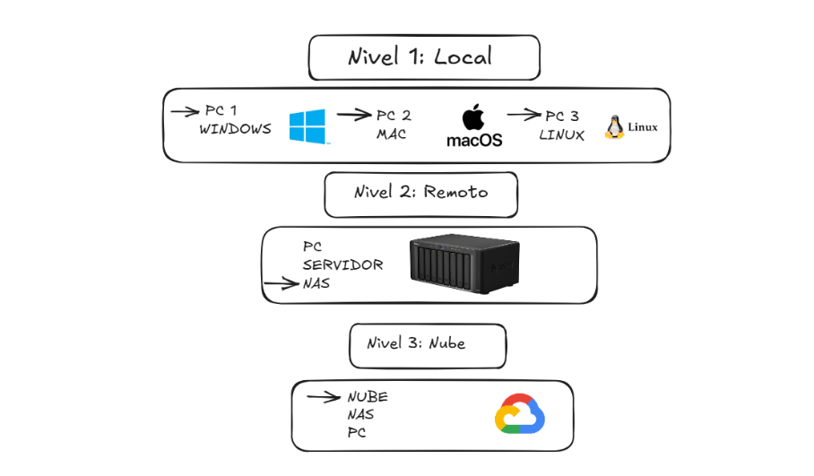
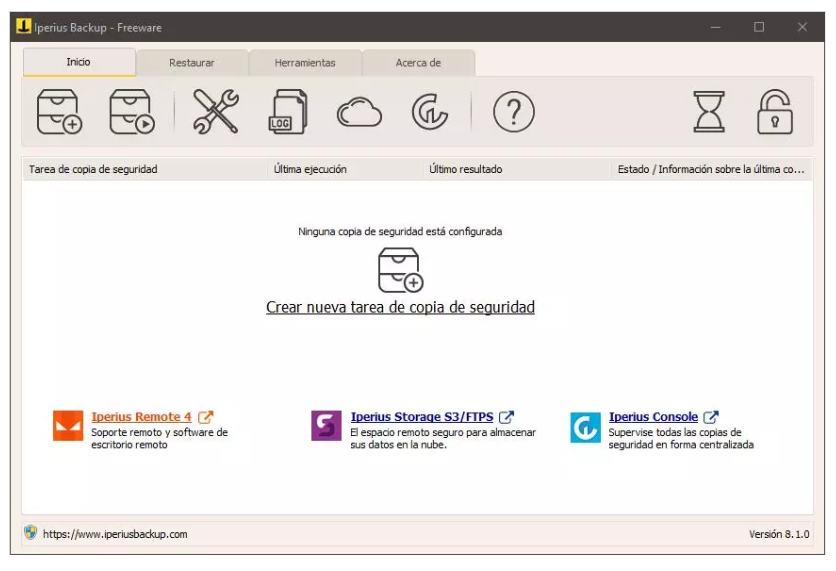
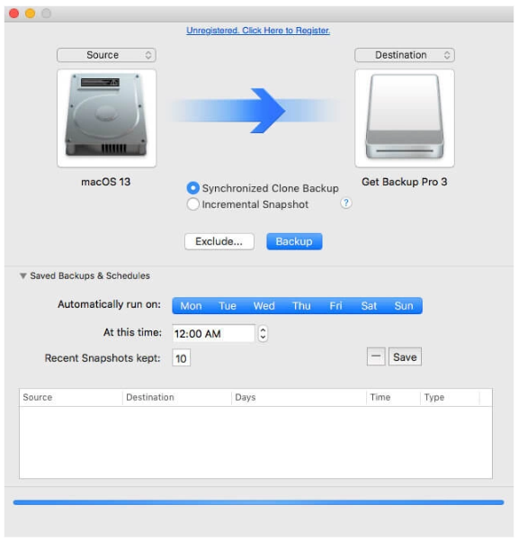
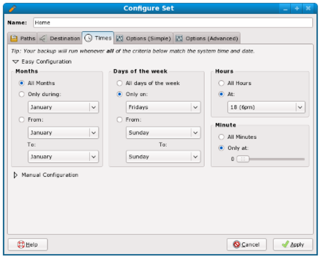
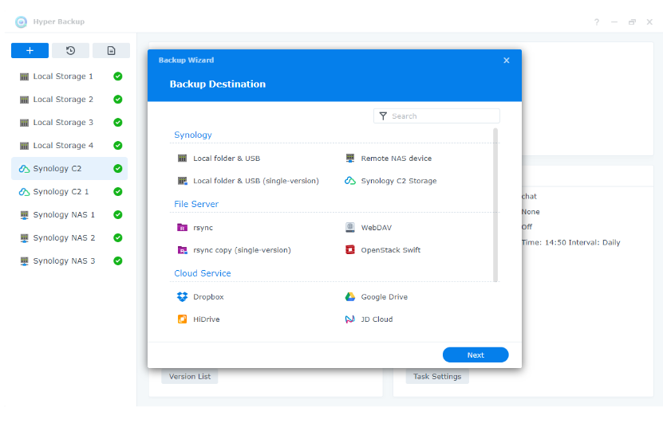
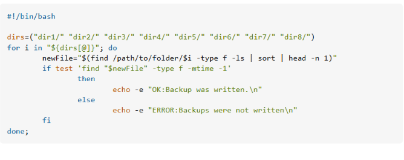

# Sistema de Copias de Seguridad Automatizadas Multicapa

## 1. Arquitectura General del Sistema

- Nivel 1: El nivel 1 su rol es la recuperación inmediata ante fallos menores (un archivo borrado por error o una instalación fallida.) En el nivel 1 hay dispositivos como discos duros, USB...

- Nivel 2: En el nivel 2 el rol es proteger contra desastres locales (incendios, inundaciones, robos). En el nivel 2 hay NAS , Servidores dedicados externos

- Nivel 3: El nivel 3 es la redundancia y disponibilidad continua desde cualquier lugar. En el nivel 3 esta google cloud,drive, wasabi…

---

## 2. Configuración del Nivel 1: PCs Individuales

### a. Selección de software
- Windows: Iperius Backup: Un programa muy completo que permite hacer copias de seguridad, destacando por ser uno de los más fáciles de usar y de configurar, así como de los que ofrecen un mejor rendimiento a la hora de realizar las copias de seguridad permitiendo, incluso siendo capaz de realizar copias de seguridad de máquinas virtuales o de Microsoft 365. Este programa cuenta con versión gratuita, versión de prueba y modalidades de pago con licencia. Ofrece una interfaz gráfica muy completa, permite realizar copias de seguridad incrementales, diferenciales y completas, además permite crear medios de recuperación, copias de seguridad en cinta, e incluso de máquinas virtuales y de microsoft 365.

- macOS: Mac Backup Guru: Aplicación de respaldo que se especializa en clonación, aportando una gran variedad de funciones a las que el usuario puede acceder en su ventana con interfaz de manera sencilla. También ofrece la posibilidad de realizar copias incrementales de una manera muy sencilla. También ofrece la posibilidad de excluir carpetas y es un programa que cuenta con versión gratuita y una versión premium. Su versión gratuita ofrece una gran variedad de opciones por lo que no es necesario actualizar a la versión de pago, cuenta con función de copia incremental para ahorrar tiempo si así se quiere y cuenta con una interfaz gráfica bastante sencilla de usar.

- Linux: Fwbackups: Herramienta de código abierto para linux, que busca simplificar la copia de seguridad de documentos al proveer una interfaz gráfica intuitiva y amigable con el usuario. Cuenta con la posibilidad de programar copias automáticas, realizar copias incrementales y diferenciales, además de soporte para respaldos locales y remotos vía SFTP/SSH. Ofrece la posibilidad de realizar copias incrementales, diferenciales y completas, es de código abierto y cuenta con una interfaz gráfica intuitiva y amigable para que el usuario pueda realizar las configuraciones que desee sin demasiada complicación.

### b. Programación de copias
- ¿Cómo se configuran las copias incrementales diarias?  

- Iperius Backup:A la hora de realizar una tarea nueva, en el apartado de carpeta de destino se puede seleccionar la opción de que primero realice una copia de seguridad completa y luego ir realizando copias de los nuevos elementos, luego se seleccionan todos los días y se crea la tarea.
- Mac Backup Guru: Una vez abierta la interfaz para realizar las copias de seguridad, se selecciona la opción de Snapsot incremental y se seleccionan todos los días de la semana.
- Fwbackup: Dentro de la pestaña de “opciones (simple)” se encuentra un toggle para indicar que las copias sean incrementales. Dentro de la pestaña de tiempo al configurar la copia, se selecciona la opción de “todos los días de la semana”

- ¿Cómo se hacen las copias completas semanales?

- Iperius Backup: Al crear una nueva tarea de copia de seguridad, basta con escoger el último día de la semana que realice una copia completa y crear la tarea. De esa manera cada semana realizará una copia completa.
- Mac Backup Guru: En la interfaz para crear una copia de seguridad, se selecciona que sincronice con el clone y elegir el último día de la semana en la barra destinada para elegir los días y ya estaría configurado
- fwbackup: Dentro de la configuración de la copia, en la pestaña de tiempo, se selecciona la opción de “solo en” y se selecciona el último día de la semana y ya estaría completo, realizará una copia completa.

### c. Destino de las copias
- ¿Dónde se almacenan?  
- ¿Cómo se organizan las carpetas por PC?

Todas y cada una de las herramientas, cuenta con la opción de configurar el destino de la copia de seguridad a la hora de crearla, por lo que dentro de esta opción solo haría falta indicar que se realicen al servidor en cuestión si cuenta con conexión previa a este, aunque en algunas esta opción es de pago. Para organizar bien las carpetas, sería necesario crear un árbol de carpetas en el que se parte de una llamada Backups, que incluye carpetas con el nombre de cada uno de los equipos, y dentro de cada uno de estas, dos carpetas más, una con las copias completas y otra con las incrementales, previamente indicando que contiene cada una de ellas nombrándolas acorde.

---

## 3. Configuración del Nivel 2: Servidor Local Primario

### a. Tipo de hardware elegido
- Opción: NAS / Ordenador (elige uno)
- Marca/modelo (si aplica): Synology DiskStation DS245

El NAS puede ser una opción muy acertada por la cantidad de características que ofrece, tales como la capacidad de montar RAID anidados y almacenamiento por nivel, un bajo coste para todo lo que aporta y compatibilidad con servidor de archivos, multimedia, web… Por tanto, un NAS es la mejor opción para tener un servidor local primario. 
Un NAS que puede una gran opción puede ser el Synology DiskStation DS245, ya que ofrece un equilibrio entre capacidad, rendimiento y escalabilidad. Tiene  2 GB de RAM, ampliables hasta 6 GB, lo que permite manejar múltiples tareas de manera fluida. Dispone de 12 bahías de discos SATA, siendo una excelente solución para quienes necesitan almacenar grandes volúmenes de datos. Además, incluye 4 puertos Gigabit Ethernet, soporte para RAID 5, 6 y otros modos, cifrado por hardware, y es compatible con entornos de virtualización, lo cual lo hace ideal para pequeñas y medianas empresas que buscan fiabilidad y protección de datos en su infraestructura. 

### b. Tipo de RAID
- Elegido: RAID 5 
- Justificación:

Elegiría el RAID 5 porque ofrece un buen equilibrio entre la protección de datos y un uso eficiente del almacenamiento. La ventaja que presenta frente a un solo disco es que, al ser un RAID de paridad, puede soportar el fallo de una unidad gracias a que permite la recuperación de datos mediante la reconstrucción de la información perdida. Esto representa una gran ventaja en entornos donde la disponibilidad y la continuidad del servicio son críticas, ya que es posible reemplazar el disco dañado sin interrumpir el funcionamiento ni perder datos importantes.

### c. Software de gestión
- Software elegido: Hyper Backup
- Función principal: Guardarse copias, eliminar datos repetidos, verificar archivos dañados...

Creo que la herramienta Hyper Backup puede ser una opción a considerar en el caso del NAS elegido, ya que está especialmente diseñada para integrarse de forma eficiente con los dispositivos Synology. 

Hyper Backup puede crear copias de seguridad automáticas de los datos almacenados en un NAS Synology. Estas copias pueden guardarse en discos externos, otros servidores o en la nube. El programa permite mantener diferentes versiones de los archivos, ahorra espacio eliminando datos repetidos y verifica que los archivos no se hayan dañado. Todo esto se configura desde una interfaz sencilla y pensada para los usuarios del ecosistema Synology.

---

## 4. Configuración del Nivel 3: Servidor Secundario Remoto

### a. Tipo de servidor remoto
- Opción elegida:  Nube 
- Justificación:

He elegido Google Cloud como opción para el servidor remoto porque ofrece una buena combinación de seguridad, facilidad de uso y precio. Comparado con otras plataformas como AWS o Azure, Google Cloud es más sencillo de configurar y resulta más asequible para proyectos como este, donde no se necesita tanta infraestructura. Además, incluye opciones de cifrado y autenticación en dos pasos, lo que garantiza que las copias estén protegidas. También destaca en áreas como inteligencia artificial y análisis de datos, lo cual puede ser útil si en el futuro se quiere ampliar el sistema o automatizar procesos. 

### b. Seguridad de la sincronización
- ¿Cómo se programa la sincronización?

Con Cloud Sync podremos sincronizar de forma automática nuestras carpetas locales o en la nube para que se suba la información de forma automática con cada cambio o poniendo ciertos días.

- ¿Qué cifrado se usa?

Google Cloud cifra los datos durante la sincronización y después de la sincronización con AES-256, las claves de cifrado pueden ser gestionadas por uno mismo con Cloud Key Management Service, permitiendo tener el control y la gestión sobre el cifrado.

- ¿Se puede activar doble autenticación? Sí.

Google Cloud tiene autenticación de dos factores que se llama Google Identity obligando a que todos los usuarios que accedan a cualquier parte de Google Cloud tenga que autenticarse ya sea con código de seguridad, sms o emails. Cualquier acción sobre backups (crear, restaurar, eliminar, etc.) requiere autenticación previa con una cuenta autorizada. Si esa cuenta tiene activada la verificación en dos pasos, también se aplica al intentar gestionar backups. Google Cloud permite establecer reglas avanzadas, como restringir acceso a backups solo desde dispositivos seguros o ubicaciones específicas, además de exigir 2FA

---

## 5. Automatización del Proceso

- Script de verificación: 

- Alerta por email: ¿Cómo se configura?

Para que un sistema automatizado envíe alertas por correo electrónico de forma efectiva, es importante entender y configurar correctamente ciertos componentes. 

Servidor SMTP es el encargado de enviar correos electrónicos. Se necesita conocer la dirección del servidor, como smtp. gmail.com o smtp. office365.com, el puerto de conexión (587 o 465) y el método de autenticación con nombre de usuario y contraseña. Es crucial que la conexión esté cifrada. 

2. Credenciales de autenticación son necesarias para evitar envíos no autorizados. Esto incluye el nombre de usuario, normalmente el correo electrónico, y una contraseña o contraseña de aplicación. Se recomienda guardar estas credenciales de forma segura. 

3. La plantilla del mensaje establece el formato y contenido del correo. Debe ser clara, incluyendo un asunto que describa brevemente el evento y un cuerpo con detalles sobre la alerta y destinatarios.

- Prueba de restauración: ¿Cada cuánto tiempo? ¿Cómo?

-Verificación de integridad para calcular y comparar de backups para asegurar que no hay corrupción de datos.
-Restauración completa para simular restauración total en entorno de pruebas

---

## 6. Justificación del uso de RAID

- ¿Por qué no sustituye al backup?
- ¿Qué pasa si solo tenemos RAID?

A pesar de que RAID ofrece redundancia y alta disponibilidad frente a fallos de hardware, no protege contra errores lógicos, corrupción de datos, desastres físicos ni eliminación accidental, por lo que no puede sustituir a las copias de seguridad

---

## 7. Resumen de Software Recomendado

| Función                        | Software Recomendado     |
|-------------------------------|--------------------------|
| Gestión centralizada          | PC Linux                 |
| Sincronización entre servidores| NAS                     |
| Monitorización                | Nube                     |

_(Puedes añadir más si lo crees necesario)_

---

## Bibliografía / Fuentes consultadas

- Fuente 1:[NAS VS PC](https://www.profesionalreview.com/2019/10/23/nas-vs-pc/)
- Fuente 2: [Modelo NAS](https://www.pccomponentes.com/synology-diskstation-ds423-servidor-de-almacenamiento-nas)
- Fuente 3: [Herramientas copias seguridad](https://www.dragonjar.org/10-extraordinarias-herramientas-para-hacer-copias-de-seguridad-en-linux.xhtml)
- Fuente 4: [Cloud](https://cloud.google.com/docs/security/encryption/default-encryption?utm_source=chatgpt.com&hl=es-419)
- Fuente 5: [Configurar email](https://vox.veritas.com/discussions/netbackup/how-to-send-mail-alert-after-backup-completed-on-aix-and-linux-os/559693)

- ...

